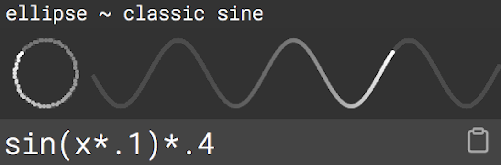

# oscillation sandbox

🔗  » [VIEW ONLINE](https://ffd8.github.io/oscillation-sandbox/)

  

explore oscillations in p5.js and beyond!  
expanding on visualizations by: [Jérôme Mercier](https://www.pizza-punk.com/oscillation-functions/)  
cc [teddavis.org](https://teddavis.org/) 2021 / [gitHub repo](https://github.com/ffd8/oscillation-sandbox)

-----

#### usage	

`x` is analogous to `frameCount` (grows +1).  
algos applied to `y` in each sketch,  
are normalized (0, 1), ie. `.5` is `height/2`.  
hover sketch to loop. click to reset.  
select algos to edit / copy + paste  

#### applying

##### shape

```js 
// shape example for p5.js
let w = width, h = height;
let xpos = frameCount % w;
let x = xpos*.2
let y = sin(x*.1)*.4
let xshape = w/2 + cos(x*.1)*w/2;
ellipse(xshape, h/2 + y*h, 50);
```

##### wave

```js 
// wave example for p5.js
let w = width, h = height;
let xpos = frameCount % w;
let x = xpos*.2; // adjust speed
let y = _insert_algo_;
ellipse(xpos, h/2 + y*h, 50);
```

#### math

p5.js math reference:  
[abs()](https://p5js.org/reference/#/p5/abs) [ceil()](https://p5js.org/reference/#/p5/ceil) [constrain()](https://p5js.org/reference/#/p5/constrain) [dist()](https://p5js.org/reference/#/p5/dist) [exp()](https://p5js.org/reference/#/p5/exp) [floor()](https://p5js.org/reference/#/p5/floor) [lerp()](https://p5js.org/reference/#/p5/lerp) [log()](https://p5js.org/reference/#/p5/log) [mag()](https://p5js.org/reference/#/p5/mag) [map()](https://p5js.org/reference/#/p5/map) [max()](https://p5js.org/reference/#/p5/max) [min()](https://p5js.org/reference/#/p5/min) [norm()](https://p5js.org/reference/#/p5/norm) [pow()](https://p5js.org/reference/#/p5/pow) [round()](https://p5js.org/reference/#/p5/round) [sq()](https://p5js.org/reference/#/p5/sq) [sqrt()](https://p5js.org/reference/#/p5/sqrt) [fract()](https://p5js.org/reference/#/p5/fract) [noise()](https://p5js.org/reference/#/p5/noise) [random()](https://p5js.org/reference/#/p5/random) [acos()](https://p5js.org/reference/#/p5/acos) [asin()](https://p5js.org/reference/#/p5/asin) [atan()](https://p5js.org/reference/#/p5/atan) [atan2()](https://p5js.org/reference/#/p5/atan2) [cos()](https://p5js.org/reference/#/p5/cos) [sin()](https://p5js.org/reference/#/p5/sin) [tan()](https://p5js.org/reference/#/p5/tan) [degrees()](https://p5js.org/reference/#/p5/degrees) [radians()](https://p5js.org/reference/#/p5/radians)

#### contribute

add new algos directly from [oscillation-sandbox](https://ffd8.github.io/oscillation-sandbox/) / [issue](https://github.com/ffd8/oscillation-sandbox/issues).  
